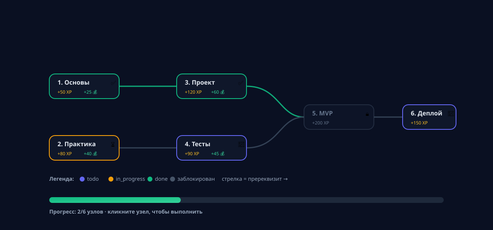

<p align="center">
  
</p>

<p align="center">
  <b>English</b> · <a href="README.ru.md">Русский</a>
</p>

<p align="center">
  
  
  
  
  
  
  
</p>

---

## What is this

LevelUp is an **RPG task tracker**:

-  **Branches & quests** — organize tasks into directions, each quest rewards XP and gold.
-  **Timers** — timed quests track hours and pay proportional rewards.
-  **Roadmap graphs** — nodes with prerequisites form a real directed acyclic graph.
-  **Shop** — spend gold on other players' items or sell your own.
-  **Workshop** — publish roadmaps and install other people's ones.
-  **Statistics** — XP, gold, completed quests and hours in ClickHouse.
-  **Landing + personal account** — light/dark theme, accessible interface (WAI-ARIA).

## Technologies

**Backend** — Go 1.26, Gin, GORM, PostgreSQL, Redis (cache + rate limit), ClickHouse (statistics via outbox), JWT auth + GitHub OAuth, Prometheus metrics, Swagger.

**Frontend** — React 18, TypeScript, Tailwind CSS, Vite.

**Infrastructure** — Docker, Prometheus, Grafana, GitHub Actions, Nginx.

## How to use

### Docker

```bash
# from the repo root
docker compose -f deploy/docker-compose.dev.yml up -d --build
```
### Native development

```bash
$ docker compose -f deploy/docker-compose.dev.yml up -d postgres redis clickhouse

$ cp .env.example .env  

$ make migrate-up
$ make migrate-up-clickhouse
$ make run

$ cd web && npm ci && npm run dev
```

## API documentation

Interactive Swagger UI: **http://localhost:8080/swagger/index.html** (also available at http://localhost/swagger).

The backend exposes `GET /healthz`, `GET /readyz`, `GET /metrics` and the `/api/v1/*` REST API with JWT auth.

## Metrics

- **Prometheus** — http://localhost:9090 (service metrics, request latencies, HTTP codes).
- **Grafana** — http://localhost:3000 (dashboard `levelup.json`, credentials `admin`/`admin`).

## Testing

```bash
make test    
make e2e     
```

## 📄 License

Released under the [MIT License](LICENSE).
